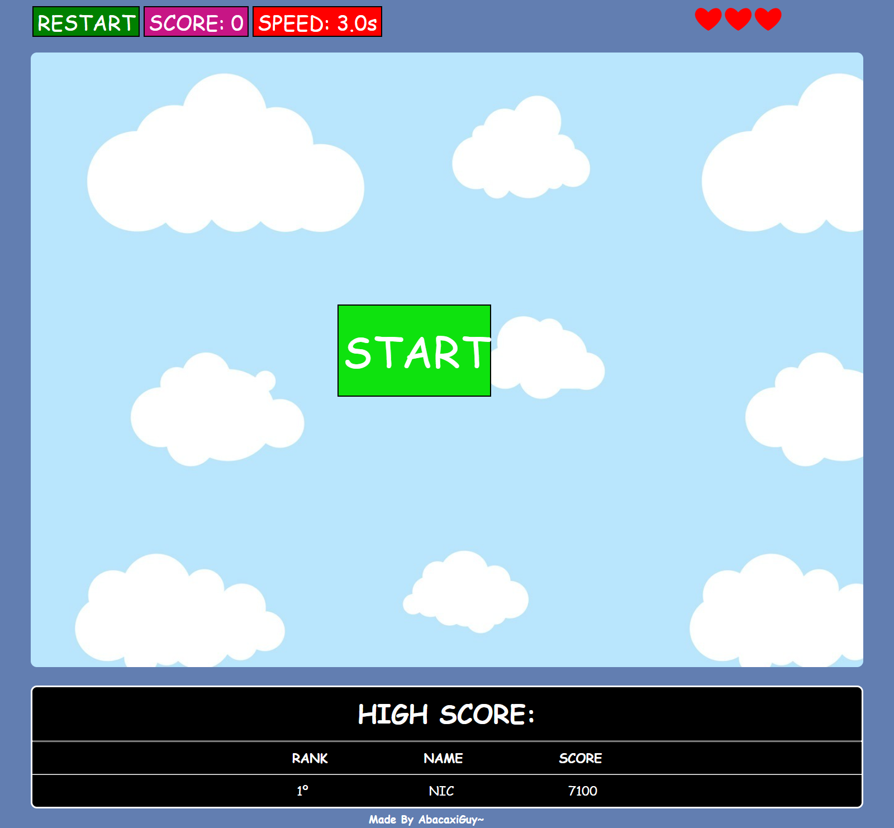

 

  

    
  

# 🗻 Pizzas on the cliff, catch 'em all! 🍕

  
  
  

 

  

---

## 🤔 Why?

So, this project was a fun one, it was created a long time ago, even before this github user was registered. This was a lil challenge made by my friends, in a time that i didn't even knew how to do anything with ``js`` basically.

The rules of the game are pretty simples, you just have to catch all the pizzas that are falling of the cliff, and don't let them drop to the ground.

You have **3 lifes ❤❤❤** and the cadence of the falling pizzas is increasing, you have to be quick!

The highscore table is only offline (for now... [#4](https://github.com/abacaxiguy/pizza-cliff/issues/4))

---

## 🤝 Contributing

Contributions, issues and feature requests are welcome! Feel free to check [issues page](https://github.com/abacaxiguy/dogs/issues).

---

## 📋 Tested in

- `Windows 10` - **Google Chrome** (1920x1080) ✅
- `Linux` [Ubuntu 18.04.4 LTS] - **Google Chrome** (1280x720) ✅

---

<h4  align="center">Developed by 🍍</h4>